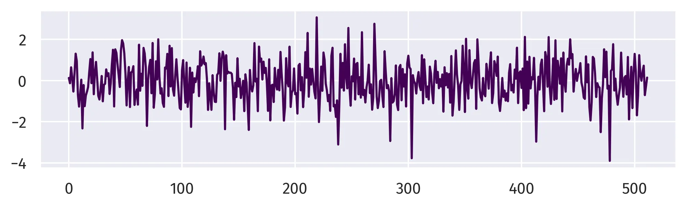
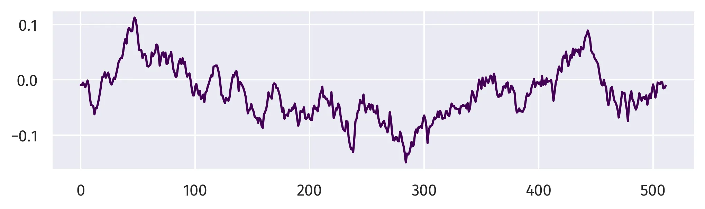
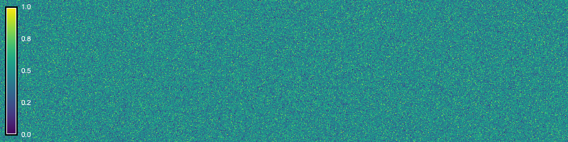
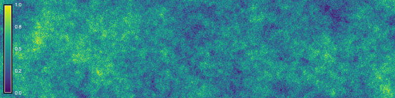
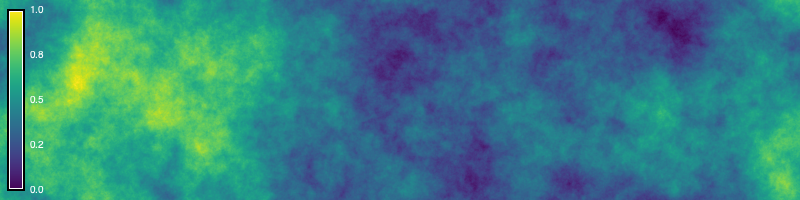
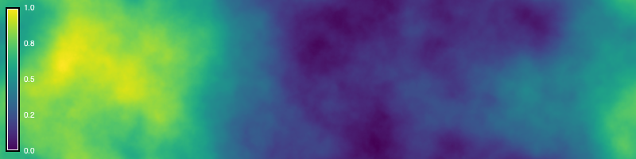

This tutorial is an introduction to generating procedural noise 
with Python scripting in GRASS. 
The computer graphics community has developed stochastic functions 
for procedurally modeling textures.
These procedural noise functions
are useful for generating synthetic data
representing stochastic natural phenomena
such as terrain, water, and clouds. 
Let's implement procedural noise using map algebra in GRASS!
This tutorial covers:

* Random walks
* Gradient noise
* Billow noise
* Ridge noise
* Fractal noise
* Multifractal noise
* Colored noise

::: {.callout-note title="Computational notebook"}
This tutorial can be run as a computational notebook.
Learn how to work with notebooks in the tutorial
.
:::

# Setup

Start a GRASS session in a new project
with a Cartesian (XY) coordinate system.
Use 
to set the extent and resolution of the computational region.
Create a region starting at the origin
and extending two hundred units north and eight hundred units east.

```{python}
# Import libraries
import os
import sys
import subprocess
from pathlib import Path

# Find GRASS Python packages
sys.path.append(
  subprocess.check_output(
    ["grass", "--config", "python_path"],
    text=True
    ).strip()
  )

# Import GRASS packages
import grass.script as gs
import grass.jupyter as gj

# Create a temporary folder
import tempfile
temporary = tempfile.TemporaryDirectory()

# Create a project in the temporary directory
gs.create_project(path=temporary.name, name="xy")

# Start GRASS in this project
session = gj.init(Path(temporary.name, "xy"))

# Set region
north = 200
east = 800
south = 0
west = 0
res = 1
gs.run_command("g.region", n=north, e=east, s=south, w=west, res=res)
```

# Random Walks

In a random walk,
a walker traverses a space 
by taking a sequence of steps
in random directions. 
Random walks can used to simulate stochastic processes
such as migration, searching, foraging, accumulation, and diffusion.
Depending on the number of walkers and steps,
2-dimensional random walks can create 
sparse or dense stochastic surfaces,
which can be useful 
for generating other forms of procedural noise.
In GRASS, 2-dimensional random walks 
can be generated with the addon
.
Walkers will traverse the computational region,
each stepping cell by cell 
in a random direction
across a raster grid. 
The output raster records the frequency of visits per cell. 
First install  with
. 

```{python}
gs.run_command("g.extension", extension="r.random.walk")
```

Then run  
with multiple walkers.
Experiment with the parameters.
Try varying the number of steps and walkers.
If it runs slowly, try increasing the memory or number of processes.
The resulting random walk can be used
instead of an initial random or fractal surface
in the following sections of this tutorial.

```{python}
# Set parameters
directions = 8
steps = 50000
walkers = 10
memory = 1200

# Generate random walks
gs.run_command(
    "r.random.walk",
    output="walk",
    directions=directions,
    steps=steps,
    nwalkers=walkers,
    memory=memory,
    flags="s",
    overwrite=True
    )

# Set color gradient
gs.run_command("r.colors", map="walk", color="viridis")

# Visualize
m = gj.Map(width=800)
m.d_rast(map="walk")
m.d_legend(raster="walk", color="white", at=(5, 95, 1, 3))
m.show()
```


# Gradient Noise

The original form of gradient noise - Perlin noise - 
is generated by interpolating between 
random gradient vectors on a grid and their offsets 
[@Perlin:1985].
We will use map algebra to generate 
a generalized form of gradient noise
by progressively smoothing a random raster surface.
First create a random surface
using the raster calculator
.
Use [formatted string literals](https://docs.python.org/3/tutorial/inputoutput.html#tut-f-strings)
to insert variables 
into raster calculator expressions 
in Python scripts. 
Then use a `for` loop 
to progressively smooth the random surface
using nearest neighbors analysis
with .
Calculate the average neighborhood
using a circular moving window.
The key parameters for our gradient noise function are
the `seed` of the pseudo-random number generator,
the `amplitude` of the surface, 
the `iterations` of smoothing,
and the `wavelength` of the moving window.
Experiment with these parameters. 
Try setting different values for each of them. 
Then try using random walks
generated with 
or a fractal surface
generated with 
instead of a random surface. 

```{python}
# Set parameters
seed = 0
amplitude = 100.0
iterations = 3
wavelength = 33

# Generate random surface
gs.mapcalc(f"noise = rand({-amplitude}, {amplitude})", seed=seed)

# Generate gradient noise
for i in range(iterations):

    # Smooth noise
    gs.run_command(
      "r.neighbors",
      input="noise",
      output="noise",
      size=wavelength,
      method="average",
      flags="c",
      overwrite=True
      )

# Set color gradient
gs.run_command("r.colors", map="noise", color="viridis")

# Visualize
m = gj.Map(width=800)
m.d_rast(map="noise")
m.d_legend(raster="noise", at=(5, 95, 1, 3))
m.show()
```


# Billow Noise

Billow noise or turbulence is a variation of gradient noise.
After generating gradient noise, 
use the raster map calculator

to take the absolute value of the noise raster.
This will transform pits and valleys into peaks and ridges
and form new valleys near zero elevation,
creating a billowing cloudy effect. 

```{python}
# Set parameters
seed = 0
amplitude = 100.0
iterations = 3
wavelength = 33

# Generate random surface
gs.mapcalc(f"noise =  rand(-{amplitude}, {amplitude})", seed=seed)

# Generate perlin noise
for i in range(iterations):

    # Smooth noise
    gs.run_command(
      "r.neighbors",
      input="noise",
      output="noise",
      size=wavelength,
      method="average",
      flags="c",
      overwrite=True
      )

# Calculate absolute value
gs.mapcalc("turbulence =  abs(noise)")

# Visualize
m = gj.Map(width=800)
m.d_rast(map="turbulence")
m.d_legend(raster="turbulence", color="white", at=(5, 95, 1, 3))
m.show()
```


# Ridge Noise

Ridge noise is another variation of gradient noise.
After generating gradient noise, 
use the raster map calculator

to subtract the absolute value of the noise raster
from an offset and then raise it to an exponent. 
This will transform the valleys of billow noise into ridges.
The key parameters for our ridge noise function are
the `seed` of the pseudo-random number generator,
the `amplitude` of the surface, 
the `iterations` of smoothing,
the `wavelength` of the moving window,
the `offset` of the ridges,
and the `exponent` for scaling the ridges.

```{python}
# Set parameters
seed = 0
amplitude = 100.0
iterations = 3
wavelength = 33
offset = 10
exponent = 2

# Generate random surface
gs.mapcalc(f"noise =  rand(-{amplitude}, {amplitude})", seed=seed)

# Generate perlin noise
for i in range(iterations):

    # Smooth noise
    gs.run_command(
      "r.neighbors",
      input="noise",
      output="noise",
      size=wavelength,
      method="average",
      flags="c",
      overwrite=True
      )

# Calculate ridge function
gs.mapcalc(f"ridge =  exp({offset} - abs(noise), {exponent})")

# Visualize
m = gj.Map(width=800)
m.d_rast(map="ridge")
m.d_legend(raster="ridge", at=(5, 95, 1, 3))
m.show()
```


# Fractal Noise

Fractional Brownian motion 
is a random walk through space
that is contingent on past steps
and has self-similar fractal properties.
Fractal noise can be generated
from fractional Brownian motion 
by accumulating octaves, i.e. iterations, 
of procedural noise
with incremental changes 
in frequency and amplitude
[@Musgrave:2003; @Gonzalez:2015; @Quilez:2019].
First, use the raster map calculator

to create a constant surface.
Then use a `for` loop
to iterate through each octave. 
For each octave,
generate gradient noise,
add the gradient noise to the prior surface
using ,
and then increment the function's fractal parameters. 
The key parameters for our fractal Brownian motion function are
the `seed` of the pseudo-random number generator,
the `amplitude` of the surface, 
the `iterations` of smoothing,
the `wavelength` of the moving window,
the `octaves` for accumulating noise,
the `lacunarity` or change in frequency of each octave,
and the `gain` in amplitude for each octave.

```{python}
# import libraries
import random

# Set parameters
seed = 0
amplitude = 100.0
iterations = 3
wavelength = 33
octaves = 6
lacunarity = 0.5
gain = 0.2

# Generate zeros
gs.mapcalc("fbm = 0")

# Generate fractional Brownian motion
for octave in range(octaves):

    # Generate random surface
    gs.mapcalc(f"noise = rand(-{amplitude}, {amplitude})", seed=seed)
    
    # Generate gradient noise
    for i in range(iterations):
    
        # Smooth noise
        gs.run_command(
          "r.neighbors",
          input="noise",
          output="noise",
          size=wavelength,
          method="average",
          flags="c",
          overwrite=True
          )

    # Calculate sum of gradient noise maps
    gs.mapcalc("fbm = fbm + noise")

    # Increment parameters
    amplitude = amplitude * gain
    wavelength = round(wavelength * lacunarity)
    if wavelength % 2 == 0:
        wavelength += 1

# Visualize
m = gj.Map(width=800)
m.d_rast(map="fbm")
m.d_legend(raster="fbm", at=(5, 95, 1, 3))
m.show()
```


# Multifractal noise

Multifractal noise can be generated 
by more complex incremental accumulations 
of procedural noise
[@Musgrave:1989; @Musgrave:2004].
In this example we will model multifractal Brownian motion 
by accumulating octaves of turbulent fractal gradient noise. 
First, use the raster map calculator

to create a constant surface. 
Then use a `for` loop
to iterate through each octave. 
For each octave,
generate a fractal surface with ,
progressive smooth this surface in a nested `for` loop 
to model fractal gradient noise,
add the absolute value of fractal gradient noise 
to the prior surface scaled by amplitude,
and then increment the function's fractal parameters.
Experiment with different parameters.
Try multiplying fractal maps instead of adding them,
but be sure to start with a non-zero constant
to avoid multiplication by zero.
The key parameters for our multifractal function are
the `seed` of the pseudo-random number generator,
the `dimension` of the fractal surface,
the `amplitude` of the multifractal surface, 
the `iterations` of smoothing,
the `wavelength` of the moving window,
the `octaves` for accumulating noise,
the `lacunarity` of each octave,
and the `gain` in amplitude for each octave.

```{python}
# Set parameters
seed = 0
amplitude = 0.1
iterations = 3
wavelength = 33
octaves = 6
lacunarity = 0.5
gain = 0.05
dimension = 2.2

# Generate zeros
gs.mapcalc("multifractal = 0")

# Generate multifractal surface
for octave in range(octaves):
    
    # Generate fractal surface
    gs.run_command(
        "r.surf.fractal",
        output="fractal",
        dimension=dimension,
        seed=seed
        )

    # Generate fractal gradient noise
    for i in range(iterations):
    
        # Smooth noise
        gs.run_command(
          "r.neighbors",
          input="fractal",
          output="fractal",
          size=wavelength,
          method="average",
          flags="c",
          overwrite=True
          )

    # Calculate sum of fractal maps
    gs.mapcalc(f"multifractal = multifractal * {amplitude} + abs(fractal)")

    # Increment parameters
    dimension = dimension + gain
    amplitude = amplitude + gain
    wavelength = round(wavelength * lacunarity)
    if wavelength % 2 == 0:
        wavelength += 1

# Visualize
m = gj.Map(width=800)
m.d_rast(map="multifractal")
m.d_legend(raster="multifractal", color="white", at=(5, 95, 1, 3))
m.show()
```


# Colored Noise

In signal processing, noise is described by its color
-- by the spectral density of the signal.
These fractional noises take the form 
$1 / f^\alpha$ where $0 < \alpha < 2$
[@Mandelbrot:1968]. 
White noise has a constant spectral density and sounds indistinct. 
Examples include the radio and television static. 
Pink noise $1 / f$ has a spectral density 
that is inversely proportional to its frequency
and thus has equivalent energy in each octave. 
This gives pink noise the self similar properties 
needed for modeling fluctuating phenomena 
like clouds and terrain. 
In this example we will generate white noise 
simply by plotting a standard normal distribution.
Then we will generate fractional noise
by taking the Fourier transform of white noise,
dividing this by frequency $f^\alpha$,
and then taking its inverse Fourier transform. 
Try different values of $\alpha$
to generate other shades of colored noise!

First we will plot the waveforms 
of one-dimensional white and pink noise
with the [Seaborn](https://seaborn.pydata.org/) 
data visualization library [@Waskom:2021; @Seaborn].
To generate one-dimensional white noise, 
instantiate Numpy's random number generator
,
sample from a standard normal distribution with
,
and plot with 
.

```{python}
# Import libraries
import numpy as np
import seaborn as sns

# Set parameters
seed = 0
n = 512 # number of samples

# Generate white noise
rng = np.random.default_rng(seed)
noise = rng.standard_normal(n)

# Plot waveform
sns.lineplot(data=noise, color=(0.26, 0.004, 0.33))
```



To generate one-dimensional pink noise,
first compute the Fast Fourier Transform of the white noise with
,
then scale the transformed noise by $1 / f^\alpha$, 
compute its inverse Fast Fourier Transform with
,
and plot with 
.

```{python}
# Set parameters
alpha = 1.0 # where white=0, pink=1, red=1.5, brownian=2

# Generate pink noise
noise = np.fft.rfft(noise, n)
frequency = np.arange(1, noise.shape[-1]+1)
noise /= frequency ** alpha
noise = np.fft.irfft(noise, n)

# Plot waveform
sns.lineplot(data=noise, color=(0.26, 0.004, 0.33))
```



Now we will generate two-dimensional fractional noise
using GRASS and NumPy [@Harris:2020; @NumPy].
First, generate a random surface
with a normal distribution using

and convert this raster into an array.
Next generate a grid of frequencies.
To do this, calculate sample frequencies 
for each dimension with

register them in a grid with
,
calculate their radial distance 
from the origin with 

and then mask out zeroes
to avoid division by zero.
Compute the two-dimensional Fast Fourier Transform 
of the white noise with 
.
Divide this transformed white noise 
by the frequency raised to scaling exponent $\alpha$. 
For fractional noise with the form
$1 / f^\alpha$, 
$\alpha$ is a scaling exponent where 
zero generates white noise, 
one generates pink noise, and
two generates fractional noise. 
Compute the two-dimensional 
inverse Fast Fourier Transform of the noise with

and normalize the noise.
Now that we have generated fractional noise with NumPy,
we can write the array as a raster in GRASS.

```{python}
# Import libraries
from grass.script import array as garray
import numpy as np

# Set parameters
mean = 0
sigma = 1.0
seed = 0
alpha = 1.5 # where white=0, pink=1, red=1.5, brownian=2

# Generate random surface
gs.run_command(
    "r.surf.gauss",
    output="noise",
    mean=mean,
    sigma=sigma,
    seed=seed,
    overwrite=True
    )

# Convert to array
noise = garray.array(mapname="noise")

# Generate frequency
u = np.fft.fftfreq(east)
v = np.fft.fftfreq(north)
u, v = np.meshgrid(u, v)
frequency = np.hypot(u, v)
mask = frequency != 0
frequency[~mask] = 1.0

# Calculate noise
noise = np.fft.fft2(noise)
scaling = frequency ** alpha
noise = noise / scaling
noise = np.fft.ifft2(noise).real

# Normalize
noise = noise / np.linalg.norm(noise)
minima, maxima = np.min(noise), np.max(noise)
noise = (noise - minima) / (maxima - minima)

# Convert to raster
raster = garray.array()
for y in range(raster.shape[0]):
    for x in range(raster.shape[1]):
        raster[y, x] = noise[y, x]
raster.write(mapname="noise", overwrite=True)

# Set color table
gs.run_command("r.colors", map="noise", color="viridis")

# Visualize
m = gj.Map(width=800)
m.d_rast(map="noise")
m.d_legend(raster="noise", color="white", digits=1, fontsize=10, at=(5, 95, 1, 3))
m.show()
```







